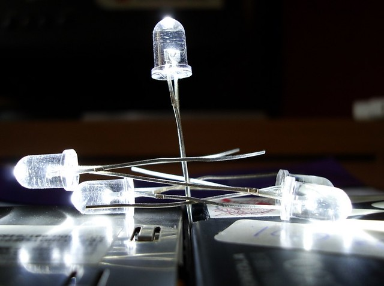

# LEDs (Light-emitting diodes)

[Photo CC-BY-NC-ND Prashant Maxsteel](https://www.flickr.com/photos/prashantmaxsteel/2576793393/)

## Symbol

## Identifying a LED's pins

### 2-pin LEDS

- Identifying with pin length
    - The longest pin is the **positive** pin (Anode)
    - The shortest pin is the **negative** pin (Cathode)
    
- Identifying by looking at the LED's plastic shell
    - If one side of the plastic base is flat, the pin on this side is
    the **negative pin**
    
- Identifying by lookin inside the LED's plastic shell
    - the smallest part is connected to the **positive** pin
    - the thickest part is connected to the **negative** pin.
    
- Identifying with a 3V coin cell battery
    - If the LED lights up, the pin on the side of the battery's + is the
    **positive** pin
    - A 3V coin cell battery is not powerful enough to damage any LED,
    so there's no need for a resistor here.

- Identifying with a multimeter
    - Align the multimeter knob with the diode symbol 
    
    - Put the red multimeter tip on one of the LED's pins, and the black to the other
    - When the LED lights up, its **positive** pin is the one connected to the
    multimeter's red tip.

### RGB LED pins

A RGB LED has four pins : one longer (Anode or cathode)
and one for each of the colours.

The base of the LED's plastic shell should be flat on one side and
not on the other. When the flat side is to the left, the order of the pins is,
from left to right:

- Red
- Anode or cathode
- Green
- Blue

To identify whether the longest pin is an anode or a cathode,
a multimeter can be used exactly like previously said for the 2-pin LED, as well 
as the 3V coin cell battery :

If the LED lights up and the longest pin is connected to the positive,
then it is an **anode**, otherwise it is a cathode.
    
### Other LEDS

- A three-pin LED is managed like a RGB LED, it only lacks a color
- A six-pin LED is a RGB LED with an anode and a cathode for each color

## How to identify a LED's optimal current ?

## How to chose the correct resistor for a given LED ?